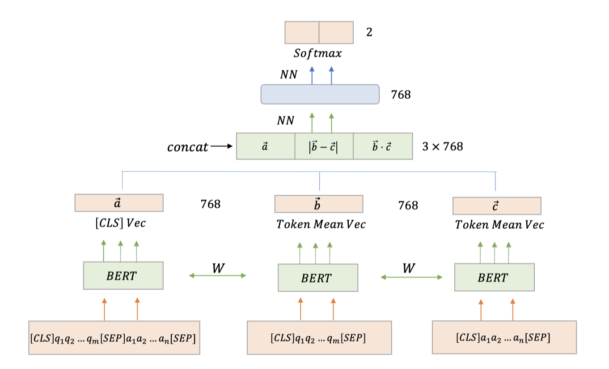
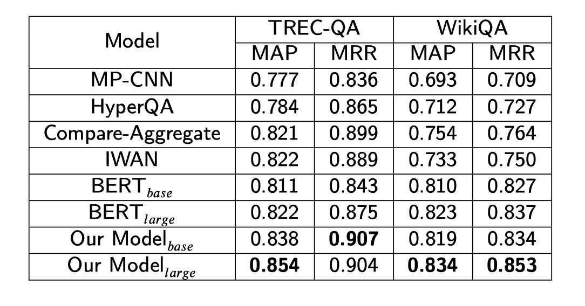

## Fusion-BERT

Using BERT and Siamese structure to do the text matching task.

### Model
This model uses BERT for sentence pair task to get [CLS] vector $\vec{a}$, and uses BERT for single text classification task to get mean token vector $\vec{b}$ and $\vec{c}$, at last concat three similar information to predict. 


### How to use
```sh
sh run.sh
```

### Result
